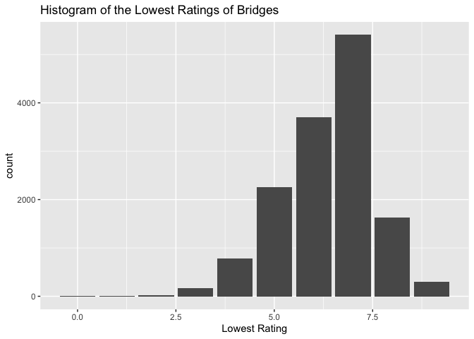
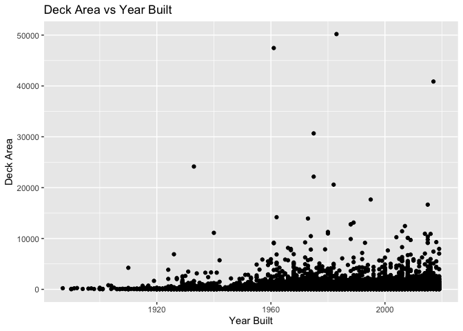

hw1
================
Dylan Asoh
9/22/2021

``` r
data <- read_csv("WI20.txt")
```

    ## Rows: 14271 Columns: 123

    ## ── Column specification ────────────────────────────────────────────────────────
    ## Delimiter: ","
    ## chr (49): STRUCTURE_NUMBER_008, ROUTE_NUMBER_005D, HIGHWAY_DISTRICT_002, COU...
    ## dbl (72): STATE_CODE_001, RECORD_TYPE_005A, ROUTE_PREFIX_005B, SERVICE_LEVEL...
    ## lgl  (2): CRITICAL_FACILITY_006B, TEMP_STRUCTURE_103

    ## 
    ## ℹ Use `spec()` to retrieve the full column specification for this data.
    ## ℹ Specify the column types or set `show_col_types = FALSE` to quiet this message.

``` r
specific_cols <- data %>% select(STRUCTURE_NUMBER_008, YEAR_BUILT_027, COUNTY_CODE_003, BRIDGE_CONDITION, LOWEST_RATING, DECK_AREA)
head(specific_cols)
```

    ## # A tibble: 6 × 6
    ##   STRUCTURE_NUMBE… YEAR_BUILT_027 COUNTY_CODE_003 BRIDGE_CONDITION LOWEST_RATING
    ##   <chr>                     <dbl> <chr>           <chr>                    <dbl>
    ## 1 00000000000F303            1932 051             P                            4
    ## 2 00000000000F304            1974 051             P                            4
    ## 3 00000000000F310            1948 115             F                            5
    ## 4 00000000000F311            1979 115             F                            5
    ## 5 00000000000F315            1977 003             F                            5
    ## 6 00000000000F317            1980 003             G                            7
    ## # … with 1 more variable: DECK_AREA <dbl>

``` r
ggplot(specific_cols) + geom_bar(aes(specific_cols$LOWEST_RATING)) + ggtitle("Histogram of the Lowest Ratings of Bridges") + xlab("Lowest Rating")
```

    ## Warning: Use of `specific_cols$LOWEST_RATING` is discouraged. Use
    ## `LOWEST_RATING` instead.

<!-- -->

``` r
ggplot(specific_cols) + geom_point(aes(YEAR_BUILT_027, DECK_AREA)) + ggtitle("Deck Area vs Year Built") + ylab("Deck Area") + xlab("Year Built")
```

<!-- -->
