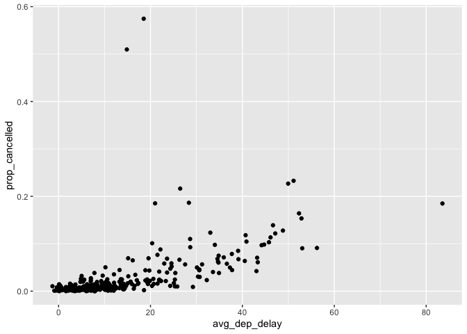
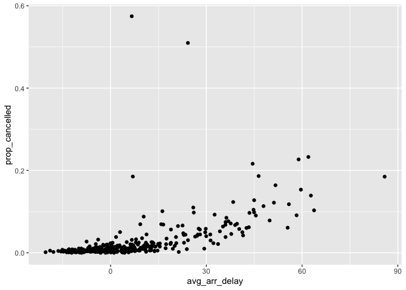

hw2
================
Dylan Asoh
9/27/2021

<https://github.com/dylanasoh/stat433/tree/master/hw2>

``` r
library(nycflights13)
library(dplyr)
```

    ## 
    ## Attaching package: 'dplyr'

    ## The following objects are masked from 'package:stats':
    ## 
    ##     filter, lag

    ## The following objects are masked from 'package:base':
    ## 
    ##     intersect, setdiff, setequal, union

``` r
library(ggplot2)
head(flights)
```

    ## # A tibble: 6 × 19
    ##    year month   day dep_time sched_dep_time dep_delay arr_time sched_arr_time
    ##   <int> <int> <int>    <int>          <int>     <dbl>    <int>          <int>
    ## 1  2013     1     1      517            515         2      830            819
    ## 2  2013     1     1      533            529         4      850            830
    ## 3  2013     1     1      542            540         2      923            850
    ## 4  2013     1     1      544            545        -1     1004           1022
    ## 5  2013     1     1      554            600        -6      812            837
    ## 6  2013     1     1      554            558        -4      740            728
    ## # … with 11 more variables: arr_delay <dbl>, carrier <chr>, flight <int>,
    ## #   tailnum <chr>, origin <chr>, dest <chr>, air_time <dbl>, distance <dbl>,
    ## #   hour <dbl>, minute <dbl>, time_hour <dttm>

``` r
flights %>% filter(is.na(dep_time))
```

    ## # A tibble: 8,255 × 19
    ##     year month   day dep_time sched_dep_time dep_delay arr_time sched_arr_time
    ##    <int> <int> <int>    <int>          <int>     <dbl>    <int>          <int>
    ##  1  2013     1     1       NA           1630        NA       NA           1815
    ##  2  2013     1     1       NA           1935        NA       NA           2240
    ##  3  2013     1     1       NA           1500        NA       NA           1825
    ##  4  2013     1     1       NA            600        NA       NA            901
    ##  5  2013     1     2       NA           1540        NA       NA           1747
    ##  6  2013     1     2       NA           1620        NA       NA           1746
    ##  7  2013     1     2       NA           1355        NA       NA           1459
    ##  8  2013     1     2       NA           1420        NA       NA           1644
    ##  9  2013     1     2       NA           1321        NA       NA           1536
    ## 10  2013     1     2       NA           1545        NA       NA           1910
    ## # … with 8,245 more rows, and 11 more variables: arr_delay <dbl>,
    ## #   carrier <chr>, flight <int>, tailnum <chr>, origin <chr>, dest <chr>,
    ## #   air_time <dbl>, distance <dbl>, hour <dbl>, minute <dbl>, time_hour <dttm>

1.  There are 8255 flights with a missing dep\_time. The arrival time,
    departure delay, arrival delay, tail number, arrival delay, and
    air\_time are also missing. These rows could represent cancelled
    flights.

2.  

``` r
flights <- flights %>% mutate(dep_time_since_midnight=(dep_time%/%100) * 60 + (dep_time%% 100),
                                                       sched_dep_time_since_midnight=(sched_dep_time%/%100) * 60 + (sched_dep_time%% 100))
flights %>% select(dep_time, dep_time_since_midnight, sched_dep_time, sched_dep_time_since_midnight)
```

    ## # A tibble: 336,776 × 4
    ##    dep_time dep_time_since_midnight sched_dep_time sched_dep_time_since_midnight
    ##       <int>                   <dbl>          <int>                         <dbl>
    ##  1      517                     317            515                           315
    ##  2      533                     333            529                           329
    ##  3      542                     342            540                           340
    ##  4      544                     344            545                           345
    ##  5      554                     354            600                           360
    ##  6      554                     354            558                           358
    ##  7      555                     355            600                           360
    ##  8      557                     357            600                           360
    ##  9      557                     357            600                           360
    ## 10      558                     358            600                           360
    ## # … with 336,766 more rows

``` r
avg_delays_cancelled <- flights %>% 
  mutate(cancelled_flight=is.na(dep_time) | is.na(arr_time)) %>% 
  group_by(year, month, day) %>% 
  summarise(prop_cancelled=mean(cancelled_flight), total_flights=n(), avg_dep_delay=mean(dep_delay, na.rm=TRUE), avg_arr_delay=mean(arr_delay, na.rm=TRUE)) 
```

    ## `summarise()` has grouped output by 'year', 'month'. You can override using the `.groups` argument.

``` r
avg_delays_cancelled %>% ggplot(aes(avg_dep_delay,prop_cancelled))  + geom_point()
```

<!-- -->

``` r
avg_delays_cancelled %>% ggplot(aes(avg_arr_delay, prop_cancelled)) + geom_point()
```

<!-- -->

3.  There is a pattern between the number of cancelled flights per day
    and the average delay per day. There is a strong increasing
    relationship between the proportion of cancelled flights and average
    arrival delay as shown by the first scatter plot. There is also a
    strong relationship between the proportion of cancelled flights and
    the average departure delay as shown by the second scatter plot.
