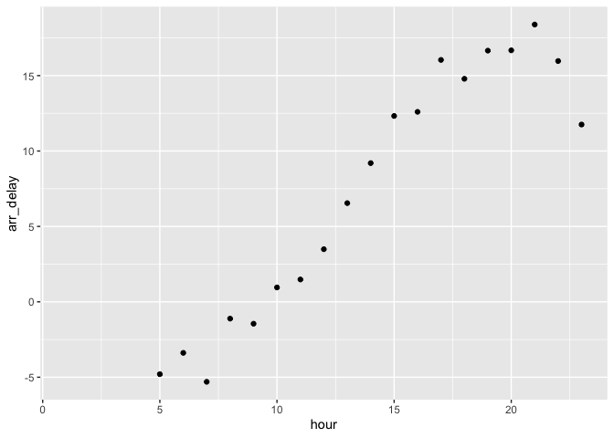
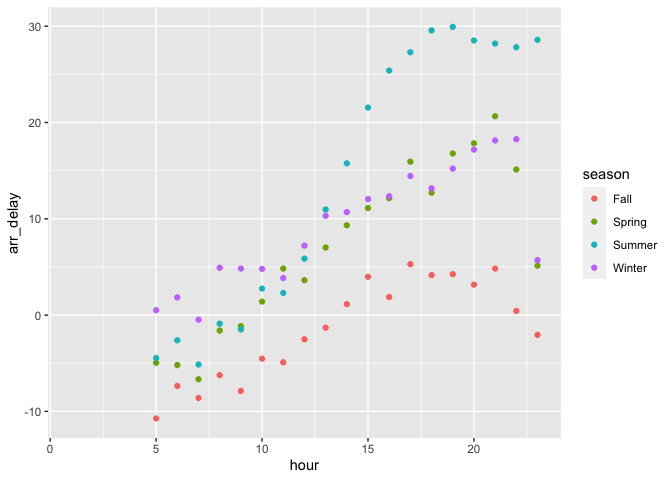
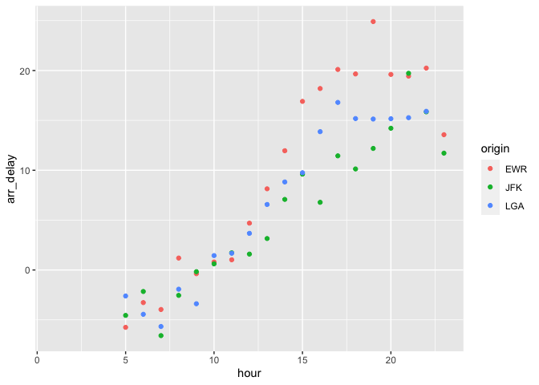

hw3
================
Dylan Asoh
10/4/2021

<https://github.com/dylanasoh/stat433/tree/master/hw3>

For my analysis I wanted to figure out what time of day you should fly
if you want to avoid delays as much as possible. To figure this out I
graphed the mean arrival delay of each hour versus the hour of the day.
I found out that with nothing else considered you should fly in the
morning, specifically 7 am, to avoid as much delays as possible.
However, there is more to consider when considering what time you should
fly during the day. I decided to graph how the season you fly in affects
your arrival delay. I found in my second graph that you should fly in
fall in order to avoid as much delays as possible. There are still other
factors to consider. I wanted to see if the airport you fly from affects
your arrival delay. I found from the third graph that out of the EWR,
JFK, and LGA airports that you should fly out of the JFK airport to
avoid as much delays as possible.

``` r
library(nycflights13)
library(dplyr)
```

    ## 
    ## Attaching package: 'dplyr'

    ## The following objects are masked from 'package:stats':
    ## 
    ##     filter, lag

    ## The following objects are masked from 'package:base':
    ## 
    ##     intersect, setdiff, setequal, union

``` r
library(ggplot2)
```

``` r
head(flights)
```

    ## # A tibble: 6 × 19
    ##    year month   day dep_time sched_dep_time dep_delay arr_time sched_arr_time
    ##   <int> <int> <int>    <int>          <int>     <dbl>    <int>          <int>
    ## 1  2013     1     1      517            515         2      830            819
    ## 2  2013     1     1      533            529         4      850            830
    ## 3  2013     1     1      542            540         2      923            850
    ## 4  2013     1     1      544            545        -1     1004           1022
    ## 5  2013     1     1      554            600        -6      812            837
    ## 6  2013     1     1      554            558        -4      740            728
    ## # … with 11 more variables: arr_delay <dbl>, carrier <chr>, flight <int>,
    ## #   tailnum <chr>, origin <chr>, dest <chr>, air_time <dbl>, distance <dbl>,
    ## #   hour <dbl>, minute <dbl>, time_hour <dttm>

``` r
flights %>% group_by(hour) %>% summarise(arr_delay=mean(arr_delay, na.rm=TRUE)) %>% ggplot(aes(hour, arr_delay)) + geom_point()
```

    ## Warning: Removed 1 rows containing missing values (geom_point).

<!-- --> As you can see
from the graph above you should fly at 7 am to avoid as much delays as
possible. In fact, you will arrive 6 minutes early. Meanwhile, it is
apparent that the time you fly in the day is directly related to your
arrival delay. When you fly earlier in the day you will on average less
of a delay that when you fly later in the day.

``` r
new_flights <- flights %>% mutate(season=case_when(
  month == 1 | month == 12 | month == 2 ~ "Winter",
  month == 3 | month == 4 | month == 5 ~ "Spring",
  month == 6 | month == 7 | month == 8 ~ "Summer",
  month == 9 | month == 10 | month == 11 ~ "Fall"
))
new_flights %>% group_by(season, hour) %>% summarise(arr_delay=mean(arr_delay, na.rm=TRUE)) %>% ggplot(aes(hour, arr_delay, color=season)) + geom_point()
```

    ## `summarise()` has grouped output by 'season'. You can override using the `.groups` argument.

    ## Warning: Removed 1 rows containing missing values (geom_point).

<!-- --> As you can see
from the graph above, flying in the fall produces the least amount of
arrival delay on average. The next best season to fly in is Spring.
Oddly as you fly later in the day during the summer you’re arrival delay
will increase drastically.

``` r
new_flights %>% group_by(origin, hour) %>% summarise(arr_delay=mean(arr_delay, na.rm=TRUE)) %>% ggplot(aes(hour, arr_delay, color=origin)) + geom_point()
```

    ## `summarise()` has grouped output by 'origin'. You can override using the `.groups` argument.

    ## Warning: Removed 1 rows containing missing values (geom_point).

<!-- --> As you can see
from the graph above, on average the airport where you will have the
least amount of arrival delay is JFK. EWR and LGA have a similar to JFK
in the morning, but as it gets later in the day they rise above the
LGA’s average arrival delay. LGA is the second best airport to fly out
of if you want to avoid as much delay as possible. EWR is the last
airport out of the three that you should fly out if you want to avoid as
much delay as possible.
