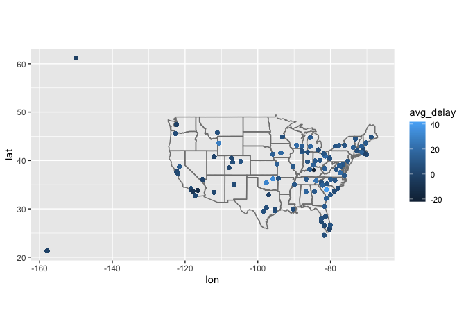
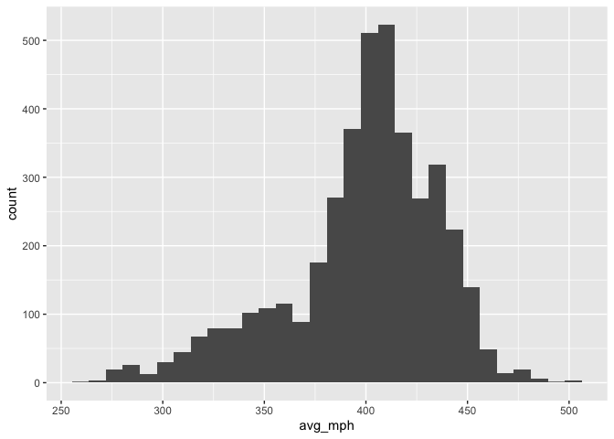

practice\_midterm
================
Dylan Asoh

## Midterm.

<https://github.com/dylanasoh/stat433/tree/master/practice_midterm>

#### 1. Map the delay by destination.

Compute the average delay by destination, then join on the airports data
frame so you can show the spatial distribution of delays. Here’s an easy
way to draw a map of the United States. You are welcome to use this code
or some other code.

``` r
library(tidyverse)
```

    ## ── Attaching packages ─────────────────────────────────────── tidyverse 1.3.1 ──

    ## ✓ ggplot2 3.3.5     ✓ purrr   0.3.4
    ## ✓ tibble  3.1.4     ✓ dplyr   1.0.7
    ## ✓ tidyr   1.1.3     ✓ stringr 1.4.0
    ## ✓ readr   2.0.1     ✓ forcats 0.5.1

    ## ── Conflicts ────────────────────────────────────────── tidyverse_conflicts() ──
    ## x dplyr::filter() masks stats::filter()
    ## x dplyr::lag()    masks stats::lag()

``` r
library(nycflights13)
flights
```

    ## # A tibble: 336,776 × 19
    ##     year month   day dep_time sched_dep_time dep_delay arr_time sched_arr_time
    ##    <int> <int> <int>    <int>          <int>     <dbl>    <int>          <int>
    ##  1  2013     1     1      517            515         2      830            819
    ##  2  2013     1     1      533            529         4      850            830
    ##  3  2013     1     1      542            540         2      923            850
    ##  4  2013     1     1      544            545        -1     1004           1022
    ##  5  2013     1     1      554            600        -6      812            837
    ##  6  2013     1     1      554            558        -4      740            728
    ##  7  2013     1     1      555            600        -5      913            854
    ##  8  2013     1     1      557            600        -3      709            723
    ##  9  2013     1     1      557            600        -3      838            846
    ## 10  2013     1     1      558            600        -2      753            745
    ## # … with 336,766 more rows, and 11 more variables: arr_delay <dbl>,
    ## #   carrier <chr>, flight <int>, tailnum <chr>, origin <chr>, dest <chr>,
    ## #   air_time <dbl>, distance <dbl>, hour <dbl>, minute <dbl>, time_hour <dttm>

You might want to use the size or colour of the points to display the
average delay for each airport.

``` r
new_flights <- flights %>% group_by(dest) %>% mutate(avg_delay=mean(arr_delay, na.rm=TRUE))
airports %>% inner_join(new_flights, c("faa" = "dest")) %>% ggplot(aes(lon, lat, color=avg_delay)) +
  borders("state") +
  geom_point() +
  coord_quickmap()
```

<!-- -->

#### 2. Do planes trade ownership?

You might expect that there’s an implicit relationship between plane and
airline, because each plane is flown by a single airline. Explore this
conjecture using data. (Let’s assume that the tail number of a plane
does not change.)

``` r
# put your answer here. 
flights_airline <- flights %>% inner_join(airlines)
```

    ## Joining, by = "carrier"

``` r
flights_airline %>% distinct(tailnum)
```

    ## # A tibble: 4,044 × 1
    ##    tailnum
    ##    <chr>  
    ##  1 N14228 
    ##  2 N24211 
    ##  3 N619AA 
    ##  4 N804JB 
    ##  5 N668DN 
    ##  6 N39463 
    ##  7 N516JB 
    ##  8 N829AS 
    ##  9 N593JB 
    ## 10 N3ALAA 
    ## # … with 4,034 more rows

``` r
sum_distinct_planes_per_airline <- flights_airline %>% rename(airline=name) %>% group_by(airline) %>% summarise(distinct=n_distinct(tailnum))  
sum(sum_distinct_planes_per_airline$distinct)
```

    ## [1] 4067

The sum of the distinct planes per airline (4067) is greater than the
number of distinct planes (4044). Therefore, 23 planes trade ownership.

#### 3a. Plane’s average speed.

Notice that `flights$air_time` is in minutes. Make a new column that is
the air time in hours.

``` r
flights_air_time_hours <- flights %>% mutate(air_time_hour=air_time / 60)
flights_air_time_hours %>% select(air_time, air_time_hour)
```

    ## # A tibble: 336,776 × 2
    ##    air_time air_time_hour
    ##       <dbl>         <dbl>
    ##  1      227         3.78 
    ##  2      227         3.78 
    ##  3      160         2.67 
    ##  4      183         3.05 
    ##  5      116         1.93 
    ##  6      150         2.5  
    ##  7      158         2.63 
    ##  8       53         0.883
    ##  9      140         2.33 
    ## 10      138         2.3  
    ## # … with 336,766 more rows

#### 4b. Average speed

For each flight, compute the average speed of that flight (in miles per
hour). Then, for each plane, compute the average of those average
speeds. Display it in a histogram. You can use a base R histogram `hist`
or ggplot’s `geom_histogram`.

``` r
flights_miles_per_hour <- flights_air_time_hours %>% mutate(mph=distance/air_time_hour)
flights_miles_per_hour %>% group_by(tailnum) %>% summarise(avg_mph=mean(mph, na.rm=TRUE)) %>% ggplot(aes(x=avg_mph))  + geom_histogram()
```

    ## `stat_bin()` using `bins = 30`. Pick better value with `binwidth`.

    ## Warning: Removed 7 rows containing non-finite values (stat_bin).

<!-- -->

#### 5. Bonus

Make a table where each row is a destination, each column is a carrier,
and each element is the number of times that the carrier has flown to
that destination. Ensure that you only count flights that arrived at the
destination.

``` r
flights_airline %>% group_by(dest, carrier) %>% summarise(count=n()) %>% pivot_wider(names_from =carrier, values_from=count)
```

    ## `summarise()` has grouped output by 'dest'. You can override using the `.groups` argument.

    ## # A tibble: 105 × 17
    ## # Groups:   dest [105]
    ##    dest     B6    EV    UA  `9E`    DL    FL    MQ    WN    AA    US    OO    YV
    ##    <chr> <int> <int> <int> <int> <int> <int> <int> <int> <int> <int> <int> <int>
    ##  1 ABQ     254    NA    NA    NA    NA    NA    NA    NA    NA    NA    NA    NA
    ##  2 ACK     265    NA    NA    NA    NA    NA    NA    NA    NA    NA    NA    NA
    ##  3 ALB      NA   439    NA    NA    NA    NA    NA    NA    NA    NA    NA    NA
    ##  4 ANC      NA    NA     8    NA    NA    NA    NA    NA    NA    NA    NA    NA
    ##  5 ATL      NA  1764   103    59 10571  2337  2322    59    NA    NA    NA    NA
    ##  6 AUS     747    NA   670     2   357    NA    NA   298   365    NA    NA    NA
    ##  7 AVL      NA   265    NA    10    NA    NA    NA    NA    NA    NA    NA    NA
    ##  8 BDL      NA   435     8    NA    NA    NA    NA    NA    NA    NA    NA    NA
    ##  9 BGR      NA   374    NA     1    NA    NA    NA    NA    NA    NA    NA    NA
    ## 10 BHM      NA   297    NA    NA    NA    NA    NA    NA    NA    NA    NA    NA
    ## # … with 95 more rows, and 4 more variables: F9 <int>, HA <int>, VX <int>,
    ## #   AS <int>
